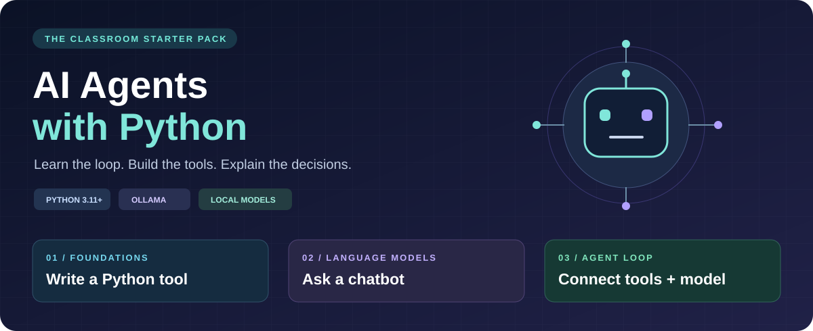
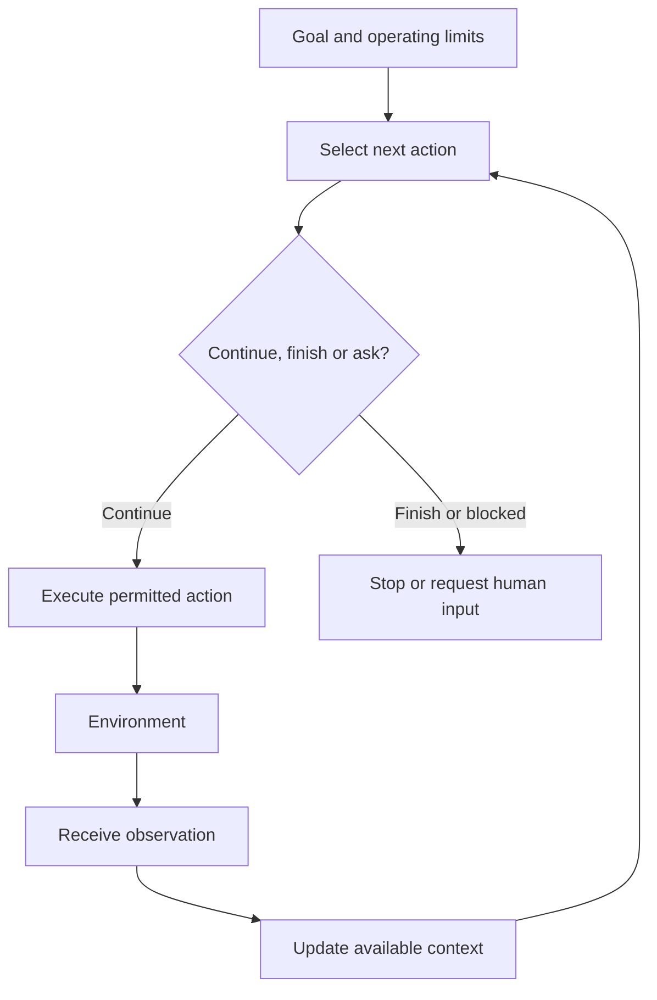
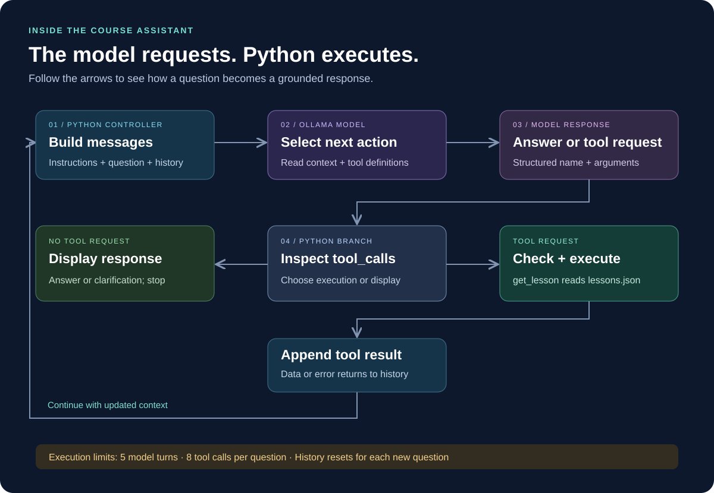

# AI Agent Foundations — From Theory to Our Course Assistant

**[← Project home](README.md) · [Next: classroom code walkthrough →](CLASSROOM_WALKTHROUGH.md) · [Teacher guide](TEACHER_GUIDE.md)**

**Teach this first:** 30-minute conceptual introduction  
**Then:** the 90-minute practical lesson in the classroom walkthrough  
**Audience:** Bachelor students beginning AI agents  
**Prerequisite:** Basic Python; no agent framework knowledge required

> [!IMPORTANT]
> **Learning objective:** Explain what an agent observes, how it selects actions, how feedback affects its next choice, and where those ideas appear in the course assistant.

## Teaching route

| Part | Main question | Time |
|---|---|---|
| 1. General idea | What makes a system an agent? | 5 minutes |
| 2. Agent cycle | How do observation, decision, action, and feedback connect? | 8 minutes |
| 3. LLM-based agents | What does the model do, and what does software do? | 7 minutes |
| 4. Our case study | Where are these concepts in our Python project? | 7 minutes |
| 5. Check understanding | Can students explain the loop without reading code? | 3 minutes |

Use sections 1–8 for the first explanation. Sections 9–14 provide examples, discussion material, and the transition into code.

## 1. What is an agent?

An **agent** is a system that receives information from an environment and selects actions that affect its interaction with that environment. We evaluate those actions against an objective or performance criterion.

The environment can be physical, such as a room, or digital, such as a database, application, or collection of files.

An agent may follow rules, use a learned model, or combine several decision methods. It does not need a language model, a human-like personality, or consciousness.

### A familiar example: a mobile robot

Imagine a robot trying to reach a destination without hitting obstacles.

| Concept | Robot example |
|---|---|
| Goal | Reach the destination |
| Environment | The room and obstacles |
| Observation | Distance-sensor readings |
| Decision | Select the next movement |
| Action | Run the motors or stop |
| Feedback | New distance and position readings |
| Performance | Reach the destination while avoiding collisions |

A simple obstacle-avoidance controller may follow fixed rules. A navigation agent may also maintain a map and plan a route. Both illustrate perception and action, but their capabilities differ.

> [!TIP]
> **Ask the class:** If the distance sensor reports a wall, what should change in the robot's next action?
>
> **Expected answer:** It should use that observation to stop, turn, or choose another route. Repeating the previous movement without using the new observation would ignore feedback.

## 2. How does an agent work in general?

A useful teaching cycle is:

1. **Observe:** receive information about the current situation.
2. **Update context:** combine the observation with relevant history or state.
3. **Decide:** choose an action based on the objective and available actions.
4. **Act:** execute the selected action through an interface.
5. **Observe the result:** determine what happened and use it in the next cycle.
6. **Stop or continue:** finish, ask for help, or choose another action.

This is a conceptual model. Some simple agents have no stored history, and some continuously operating agents do not have a single final answer.

The return path matters. An agent can change its next choice because it has received new information.

### Information-gathering is an action too

An action does not have to move a motor or modify a file. Reading a timetable, searching a document, or checking a calculation can be an action. It changes the information available to the agent.

In our project, the action reads information. The agent does not edit the timetable.

## 3. Essential vocabulary

| Term | Plain-language meaning |
|---|---|
| Goal | The result the system is trying to achieve |
| Environment | The physical or digital setting it interacts with |
| Observation | Information received from that setting |
| State or context | Information currently available for choosing an action |
| Policy | The rule or mechanism that maps available information to actions |
| Action | An operation selected by the agent |
| Tool | A software interface through which an action can be performed |
| Feedback | The observed result of an action |
| Autonomy | How much the system can choose without a human selecting every step |
| Evaluation | Checking whether the behavior and results meet expectations |

The policy does not have to be complicated. An if-statement can implement a simple decision rule. In an LLM-based agent, a model can help choose actions from the current messages and tool descriptions.

## 4. What changes when we use an LLM?

A large language model can interpret a natural-language request and generate text or structured output. In an LLM-based agent, that output may describe an action to request next.

The surrounding application supplies instructions, available tools, history, execution logic, and limits.

| Language model | Python application |
|---|---|
| Interprets the question | Receives input and assembles messages |
| Proposes a tool and arguments | Checks the name and arguments |
| Uses supplied results in its next response | Executes the function and returns its result |
| May propose another action or a final response | Manages the loop and enforces limits |

> [!IMPORTANT]
> **The model is one component of the agent system.** The complete system includes the software that executes actions and manages interaction with the environment.

A useful recipe for this project is:

**LLM + instructions + tools + working context + a controlled loop**

This is a description of our LLM-based implementation, not a universal definition of all agents. Persistent memory and multiple agents are optional extensions.

## 5. Chatbot, workflow, and agent

These terms can overlap: a chat interface can be the front end of an agent. For teaching, compare the internal control of the following examples.

| Example | Who chooses the next operational step? | What it illustrates |
|---|---|---|
| A Python loop sends five predefined prompts | The programmer's loop | Repeated LLM automation |
| A program always summarizes and then translates | A predefined sequence | An LLM workflow |
| A single model call answers a question | No external tool step is available | A basic chatbot |
| A model can request a lookup, inspect its result, and request another | Model choices within application limits | A tool-using agent |

For LLM applications, the distinction between predefined workflows and dynamically selected tool use is useful; see [Anthropic's architectural discussion](https://www.anthropic.com/engineering/building-effective-agents).

Our earlier ice-cream-description exercise demonstrates automation: Python selects each flavor and sends the next prompt. It becomes a useful foundation for understanding how an agent can instead select an available operation at runtime.

For a fixed timetable form with a week-number box, a normal lookup is enough. We use an agent here to learn how natural-language requests can guide tool use.

## 6. What does tool calling mean?

A tool is usually an ordinary function or an interface to another system. There are three distinct parts:

| Part | Example |
|---|---|
| Definition | “get_lesson retrieves a lesson using an integer week.” |
| Request | “Call get_lesson with week equal to 3.” |
| Result | The retrieved topic and lab, or a missing-information error |

A model request is structured data:

~~~json
{
  "name": "get_lesson",
  "arguments": {
    "week": 3
  }
}
~~~

It does not execute itself. The application must connect that name to a real function, check the input, run it, and return the output.

In Ollama's Python SDK, functions can be supplied as tools; their signatures and docstrings help define their schemas. The application processes returned tool calls and includes the results in subsequent messages. See the [official tool-calling documentation](https://docs.ollama.com/capabilities/tool-calling).

> [!NOTE]
> Merely writing “I checked the timetable” in a generated answer is not evidence of execution. Look for the actual tool request and returned result.

## 7. Autonomy, planning, and stopping

Autonomy is a matter of scope. A course assistant may choose which weeks to retrieve while being unable to edit files or contact anyone.

In this project, the model can propose:

- Answering without a course lookup.
- Requesting a specific week.
- Requesting several weeks for comparison.
- Asking the user to specify a week.
- Using a returned result to choose what to do next.

Python defines the available functions and stops the run at the configured limits.

The agent does not need to produce a separate written plan. Choosing actions across multiple turns can be enough for a small task. Our program has no separate planner module, task queue, or formal goal-verification component.

**Finishing is not the same as succeeding.** The current controller stops when no tool calls are present, even if the final answer is poor. Evaluation must check the answer as well as the stopping behavior.

## 8. Memory, feedback, and learning are different

| Concept | Meaning | Our project |
|---|---|---|
| Working context | Information supplied during the current task | The messages list |
| Persistent memory | Information retained across separate tasks | Not implemented |
| External knowledge | Data retrieved from a source | lessons.json |
| Feedback | Results available after an action | Tool data or error strings |
| Model learning | Changes to model parameters through training | Not performed by this application |

The messages list helps the model use a tool result during the same question. It is rebuilt each time run_agent is called.

Changing lessons.json changes the data returned by the tool. It does not retrain the model.

“Learning from feedback” should not be claimed just because a system logs results. A concrete mechanism must use that feedback, and improvements must be evaluated.

## 9. Connect the theory to our case study

### Problem statement

Students ask natural-language questions about a fictional course timetable. A plain model call does not automatically know the contents of our local timetable file.

### Goal

Answer the question using available course information, or clearly explain what information is missing.

### The mapping

| General agent concept | Course-assistant implementation | Where to show it |
|---|---|---|
| Environment | The timetable file and the terminal interaction | lessons.json and input() |
| User goal | A question such as “Compare weeks 2 and 3” | question |
| Observation | The question and later tool results | user and tool messages |
| Decision mechanism | The model generates a response or tool requests | client.chat() |
| Working state | Instructions, question, requests, and results | messages |
| Available action | Retrieve one course week | get_lesson(week) |
| Tool access boundary | Only registered functions can execute | AVAILABLE_TOOLS |
| Action execution | Python calls the selected function | `AVAILABLE_TOOLS[name](**arguments)` |
| Feedback | Retrieved lesson or error text | role: tool |
| Iteration | A new model turn uses updated history | for step in range(5) |
| Execution limits | Five model turns and at most eight tool executions | range(5), calls_used |
| Final output | Answer, clarification, or limitation message | print() and return |
| Evaluation | Compare observed calls and answers with expectations | Student results table |

> [!TIP]
> **Teacher transition:** “We have discussed observations, decisions, actions, and feedback. Now we can point to each one in a small Python project.”

## 10. Follow a question through the cycle

Use this question:

~~~text
What will we study in week 3?
~~~

| Stage | What happens | General concept |
|---|---|---|
| 1 | The terminal receives the question | Observation |
| 2 | Python sends the question, instructions, and tool descriptions | Context |
| 3 | The model may request get_lesson with week 3 | Decision |
| 4 | Python validates and executes the function | Action |
| 5 | The function reads the lesson from the JSON file | Interaction with environment |
| 6 | Python appends the result as a tool message | Feedback |
| 7 | The model receives the updated history and answers | Next decision and output |

The following is illustrative, not a captured run:

~~~text
Question: What will we study in week 3?

Requested action: get_lesson(week=3)

Observed result:
  topic: AI agents and Python tools
  lab: Build a course assistant

Possible final answer:
  In week 3, you study AI agents and Python tools.
  Your lab is to build a course assistant.
~~~

### A question requiring more information

~~~text
Compare weeks 2 and 3.
~~~

The model may request both weeks together or across separate turns. Either approach can be acceptable if it retrieves both and makes an accurate comparison.

### A missing-data case

~~~text
What will we study in week 10?
~~~

The tool reports that the week is unavailable. The intended behavior is to report this limitation, rather than invent a timetable.

### An ambiguous question

~~~text
What will we study?
~~~

The intended behavior is to ask which week. In our current program, the subsequent user reply starts a fresh run; the original question is not automatically carried forward. Students should give a self-contained follow-up, such as “What will we study in week 3?”

These are expectations to test, not guaranteed model behavior.

## 11. Why call this an agent?

It has a small amount of model-directed action selection: the model can choose whether to request the available lookup and which week to pass. Tool results return to the model so they can influence the next response.

Call it a **small LLM-based, tool-using agent with bounded autonomy**. That description is more precise than suggesting it is fully autonomous.

| Present now | Not implemented in the baseline |
|---|---|
| Model-selected lookup requests | Persistent conversation memory |
| A tool-result feedback loop | Model training or automatic self-improvement |
| Input validation and a tool allowlist | A separate planning subsystem |
| Multiple model turns | Multiple collaborating agents |
| Local JSON retrieval | Web search, vector search, or external service integration |
| Explicit execution limits | A formal evaluator that guarantees answer correctness |

It is also reasonable to explain it as a constrained agentic application. Definitions of “agent” vary; the observable control flow matters more than the label.

## 12. A tiny Python bridge before the full code

This ordinary Python example makes the execution boundary visible:

~~~python
def get_topic(week: int) -> str:
    """Retrieve fictional course information."""
    topics = {3: "AI agents and Python tools"}
    return topics.get(week, "No topic found.")

# Pretend this request came from a model.
# This example contains no actual LLM call.
request = {
    "name": "get_topic",
    "arguments": {"week": 3},
}

# Python controls which function names are executable.
allowed_tools = {"get_topic": get_topic}

name = request["name"]
arguments = request["arguments"]

if name not in allowed_tools:
    result = "Unknown tool."
elif set(arguments) != {"week"}:
    result = "Invalid argument names."
elif type(arguments["week"]) is not int or arguments["week"] < 1:
    result = "Week must be a positive integer."
else:
    # ** passes {"week": 3} as the named argument week=3.
    result = allowed_tools[name](**arguments)

print(result)
~~~

Output:

~~~text
AI agents and Python tools
~~~

**Explain:** The request is data. The registry connects a name to a function. Python executes the function. In the real agent, the request comes from the model, and the result is sent back for the next model turn.

This bridge is a demonstration of dispatching a request, not a complete agent by itself.

## 13. Questions to ask before opening the main program

| Question | Expected explanation |
|---|---|
| Does every AI agent need an LLM? | No. Rules and other decision methods can be used. |
| Does placing a file beside a chatbot give it file access? | No. The application must supply data or execute a retrieval tool. |
| Who selects the week in our agent? | The model proposes it from the question; Python checks the request. |
| Who reads the file? | The Python tool. |
| Is a file lookup an action? | Yes. It gathers information from the environment. |
| Does feedback automatically train the model? | No. Here it updates the supplied context. |
| Does a successful tool call guarantee a correct answer? | No. The model may misinterpret the result. |
| Is an agent needed for every automation task? | No. Fixed steps may be handled with a simpler workflow. |

### A two-minute classroom activity

Give pairs the task “Compare two course weeks.” Ask them to identify:

1. The goal.
2. The information source.
3. The available action.
4. The result that must return to the model.
5. One reason to stop or ask for clarification.

Then let them match their answers to the mapping table in section 9.

## 14. Move from theory into the live demonstration

Use this order:

1. **Theory:** explain the environment, cycle, and division of responsibilities using this document.
2. **Direct tool:** run course_tools.py and identify its input and result.
3. **Chatbot:** run 01_chatbot.py and discuss what information is missing.
4. **Agent:** run 02_course_agent.py and identify the actual request and result.
5. **Evaluation:** compare normal, missing-data, and ambiguous questions.
6. **Extension:** use the student assignment to add a second tool.

Continue with the [Classroom Walkthrough](CLASSROOM_WALKTHROUGH.md). All three Python files contain teaching comments.

> [!IMPORTANT]
> Before moving on, ask a student to explain this sentence in their own words:
>
> **The model selects a requested action; Python executes an allowed tool; the observed result becomes context for the next decision.**

## References and scope

- [Anthropic — Building effective agents](https://www.anthropic.com/engineering/building-effective-agents): a practical distinction between predefined LLM workflows and model-directed action selection.
- [Ollama — Tool calling](https://docs.ollama.com/capabilities/tool-calling): the request, execution, and result-message mechanism.
- [Ollama Python SDK](https://github.com/ollama/ollama-python): client usage and response objects.
- [Project implementation](02_course_agent.py): the authority for the concrete behavior described in this case study.

The lesson uses simplified teaching models and fictional timetable examples. It does not claim that the starter project implements every capability discussed. Live model behavior must be rehearsed and evaluated on the teaching computer.
