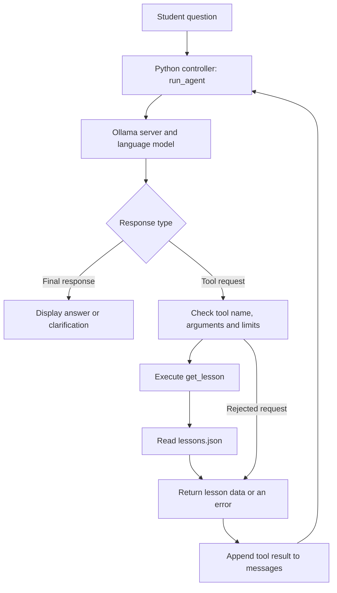
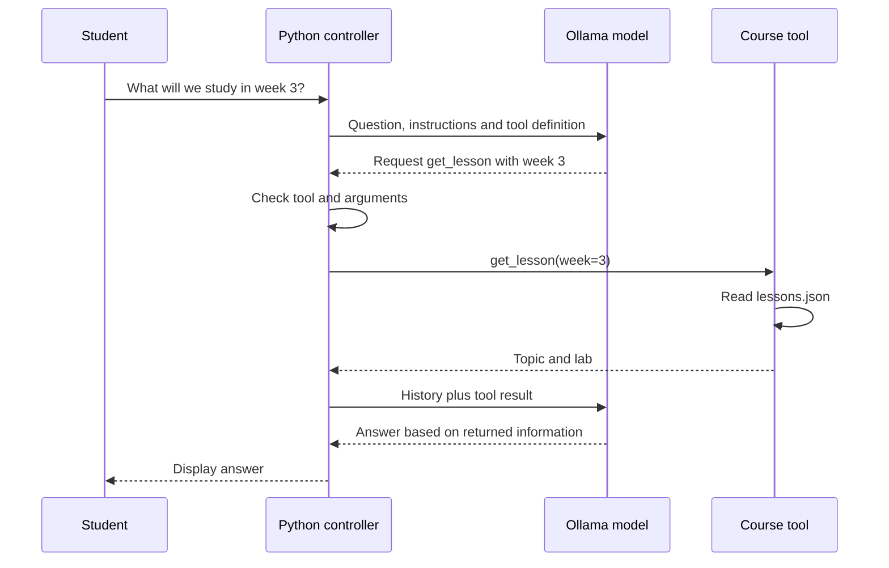

# Teaching AI Agents with Python — Classroom Walkthrough

**Audience:** Bachelor students taking their first AI-agent elective  
**Prerequisites:** Functions, dictionaries, loops, imports, and basic exceptions  
**First session:** 90 minutes  
**Project:** [AI-Course-Agent-Starter-Pack](README.md)

> [!IMPORTANT]
> **The central learning objective:** Students can explain how a model requests a tool, how Python executes it, and how the returned result affects the next model response.

## Contents

1. [Where to start teaching](#1-where-to-start-teaching)
2. [What is an AI agent in this project?](#2-what-is-an-ai-agent-in-this-project)
3. [Complete project architecture](#3-complete-project-architecture)
4. [Demonstration one: an ordinary Python tool](#4-demonstration-one-an-ordinary-python-tool)
5. [Demonstration two: a chatbot](#5-demonstration-two-a-chatbot)
6. [What exactly is tool calling?](#6-what-exactly-is-tool-calling)
7. [Walk through the agent code](#7-walk-through-the-agent-code)
8. [One complete request](#8-one-complete-request)
9. [Add a second tool](#9-add-a-second-tool)
10. [First 90-minute class](#10-first-90-minute-class)
11. [Setup and demonstration commands](#11-setup-and-demonstration-commands)
12. [Evaluation and limitations](#12-evaluation-and-limitations)

## 1. Where to start teaching

Start with one question:

> How can an AI answer questions about our course timetable?

Use three separate demonstrations: a Python function, a chatbot, and an agent that chooses when to call the function.

| Stage | What students learn | Project file |
|---|---|---|
| 1. Ordinary Python | A function receives input and returns data | [course_tools.py](course_tools.py) |
| 2. LLM application | A model receives messages and generates a response | [01_chatbot.py](01_chatbot.py) |
| 3. Tool calling | A model requests a function with structured arguments | [02_course_agent.py](02_course_agent.py) |
| 4. Agent loop | Python executes tools and sends results back to the model | [02_course_agent.py](02_course_agent.py) |
| 5. Extension | Add another tool and evaluate its use | [STUDENT_ASSIGNMENT.md](STUDENT_ASSIGNMENT.md) |

Begin with functions, dictionaries, and loops. Introduce frameworks such as CrewAI after students can explain the underlying loop.

A program that loops through ice-cream prompts is a useful bridge: Python determines the sequence of prompts in that program. In the course agent, the model can select a tool and its arguments during execution.

## 2. What is an AI agent in this project?

For this lesson, use this definition:

> An LLM-based agent is a program that uses a language model to select actions, executes permitted actions through tools, and uses the results to continue working toward a goal.

The course agent's goal is to answer a student's question using the available course information.

For example:

~~~text
Student: What will we study in week 3?
~~~

The model can request:

~~~json
{
  "name": "get_lesson",
  "arguments": {
    "week": 3
  }
}
~~~

Python then executes:

~~~python
get_lesson(week=3)
~~~

The result is sent back to the model, which can turn it into a readable answer.

> [!TIP]
> **The model requests the action. Python performs the action.**
> The model does not automatically open the JSON file, run the function, or gain access to everything on the computer.

## 3. Complete project architecture

| Component | Implementation | Responsibility |
|---|---|---|
| User interface | `input()` and `print()` | Receive questions and display results |
| Controller | `run_agent()` | Manage model turns, tools, history, and stopping |
| Model connection | `Client(host="http://localhost:11434")` | Communicate with the local Ollama server |
| Language model | `llama3.2:3b` | Generate an answer or request tools |
| Instructions | The `system` message | Describe intended behavior |
| Tool registry | `AVAILABLE_TOOLS` | Define which functions Python may execute |
| Tool | `get_lesson()` | Validate the week and retrieve data |
| Data source | `lessons.json` | Store the fictional timetable |
| Working history | `messages` | Hold the question, requests, and results |
| Execution limits | Five model turns and eight tool calls | Bound the work per question |

Ollama lists Llama 3.2 as supporting tools. Actual tool-selection reliability still needs testing on the classroom prompts.

## 4. Demonstration one: an ordinary Python tool

Show this standalone example before opening the full agent. It uses an in-memory dictionary to make the concept easy to see; the project implementation reads JSON instead.

~~~python
lessons = {
    1: "Python foundations",
    2: "Language models and prompting",
    3: "AI agents and Python tools",
}

def get_lesson(week: int) -> str:
    """Return the topic for a course week."""
    if type(week) is not int or week < 1:
        return "Error: week must be a positive integer."

    return lessons.get(week, "No lesson information for this week.")

print(get_lesson(3))
print(get_lesson(10))
~~~

Output:

~~~text
AI agents and Python tools
No lesson information for this week.
~~~

Explain:

- `week` is the function's input.
- The dictionary is the information source.
- `return` provides the result.
- No language model is involved.

**Ask:** Who selected week 3?

**Answer:** The programmer selected it by writing `get_lesson(3)`.

The actual [course_tools.py](course_tools.py) uses the same idea but reads [lessons.json](lessons.json). It also handles missing files and invalid JSON.

One useful detail is:

~~~python
data.get(str(week), ...)
~~~

This is an excerpt. JSON object keys are strings, so Python converts the integer `3` into the key `"3"`.

## 5. Demonstration two: a chatbot

The [01_chatbot.py](01_chatbot.py) program sends a question to the model without providing the timetable or a retrieval tool.

A simplified standalone equivalent is:

~~~python
from ollama import chat

response = chat(
    model="llama3.2:3b",
    messages=[
        {
            "role": "system",
            "content": "Be brief. Do not invent course details.",
        },
        {
            "role": "user",
            "content": "What will we study in week 3?",
        },
    ],
)

print(response.message.content)
~~~

**Ask:** Did this program read `lessons.json`?

**Answer:** No.

The file might be in the same folder, but the model does not automatically receive its contents. It may admit uncertainty or produce an unsupported answer. This gives students a concrete reason for adding a tool.

## 6. What exactly is tool calling?

Tool calling involves three separate objects:

| Object | Meaning |
|---|---|
| Tool definition | Describes what a function does and which inputs it accepts |
| Tool request | The model's proposed function name and arguments |
| Tool result | The output produced when the program executes the function |

For `get_lesson`, a simplified tool definition looks like this:

~~~json
{
  "type": "function",
  "function": {
    "name": "get_lesson",
    "description": "Look up the lesson for a course week.",
    "parameters": {
      "type": "object",
      "properties": {
        "week": {
          "type": "integer",
          "description": "Positive integer course week."
        }
      },
      "required": ["week"]
    }
  }
}
~~~

This description lets the model form a request such as:

~~~json
{
  "name": "get_lesson",
  "arguments": {
    "week": 3
  }
}
~~~

With the Ollama Python SDK, functions can be passed through `tools=[get_lesson]`. The SDK derives a tool schema from the function's signature and documentation. Python still executes the requested function and returns its result.

A schema describes acceptable inputs; runtime validation checks what actually arrived. See [Ollama's tool-calling documentation](https://docs.ollama.com/capabilities/tool-calling).

## 7. Walk through the agent code

Open [02_course_agent.py](02_course_agent.py) and explain these pieces in order. The following are explanatory excerpts, not a replacement program.

### A. Register the executable functions

~~~python
AVAILABLE_TOOLS = {
    "get_lesson": get_lesson,
}
~~~

The key is a name. The value is the actual Python function. This dictionary connects a model-generated name to an allowed implementation.

### B. Build the message history

~~~python
messages = [
    {
        "role": "system",
        "content": "Use get_lesson for specific course weeks.",
    },
    {
        "role": "user",
        "content": question,
    },
]
~~~

The real program includes additional instructions about missing information, errors, and clarification.

| Role | What it contains |
|---|---|
| `system` | Instructions for the assistant |
| `user` | The student's question |
| `assistant` | A model response, possibly containing tool requests |
| `tool` | Results from executed functions |

### C. Ask the model what to do next

~~~python
response = client.chat(
    model="llama3.2:3b",
    messages=messages,
    tools=list(AVAILABLE_TOOLS.values()),
    options={"temperature": 0},
)
~~~

The model receives the current messages and tool descriptions. `temperature=0` reduces sampling variation; it does not guarantee correct decisions.

### D. Preserve the model's response

~~~python
messages.append(response.message)
~~~

This preserves the assistant's tool request as part of the conversation.

### E. Check whether it requested a tool

~~~python
if not response.message.tool_calls:
    print("Assistant:", response.message.content)
    return
~~~

In this application, a response without tool calls ends the current run. It could be an answer, clarification, or admission that the information is unavailable.

Ending a run does not itself prove that the answer is correct.

### F. Execute the requested function

~~~python
name = call.function.name
arguments = call.function.arguments

if name not in AVAILABLE_TOOLS:
    result = "Error: unknown tool."
else:
    try:
        result = AVAILABLE_TOOLS[name](**arguments)
    except (TypeError, ValueError):
        result = "Error: invalid tool arguments."
~~~

For a request containing:

~~~python
name = "get_lesson"
arguments = {"week": 3}
~~~

the valid execution is equivalent to:

~~~python
result = get_lesson(week=3)
~~~

Explain `**arguments` separately using this runnable Python example:

~~~python
def greet(name):
    return f"Hello, {name}!"

values = {"name": "Otto"}
print(greet(**values))
~~~

Output:

~~~text
Hello, Otto!
~~~

Here, `**values` passes the dictionary entries as named arguments.

### G. Return the result to the model

~~~python
messages.append({
    "role": "tool",
    "tool_name": name,
    "content": str(result),
})
~~~

The next model call receives the tool result through `messages`.

> [!IMPORTANT]
> Printing a tool result is not enough. It must be included in the next model request.

### H. Repeat within limits

~~~python
for step in range(5):
    # Ask the model, process requests, and append results.
    ...
~~~

This excerpt shows the loop structure. The agent can request more information in later turns. It stops when it produces a response without tool calls or reaches an execution limit. The existing program also permits no more than eight tool executions per question.

The repeated decision–action–observation process is the agent loop.

## 8. One complete request

Use the actual week 3 data from the repository.

An illustrative trace, rather than a captured live run:

~~~text
You: What will we study in week 3?

[Model turn 1]
[Tool requested] get_lesson: {'week': 3}
[Tool result] {"topic": "AI agents and Python tools",
               "lab": "Build a course assistant"}

[Model turn 2]
Assistant: In week 3, you study AI agents and Python tools.
The lab is to build a course assistant.
~~~

| Pause and ask | Answer |
|---|---|
| Which part generated the tool request? | The model |
| Which part opened the file? | The Python function |
| Which part turned the returned data into an explanation? | The model's next response |

## 9. Add a second tool

This extension is also described in [TEACHER_SOLUTION.md](TEACHER_SOLUTION.md). Keep the solution until students have tried the task.

Add this function to `course_tools.py`:

~~~python
def get_assignment(week: int) -> str:
    """Find the assignment for a course week.

    Args:
        week: Positive integer course week.
    """
    if type(week) is not int or week < 1:
        return "Error: week must be a positive integer."

    # Fictional teaching data.
    assignments = {
        3: "Build a course assistant and record five evaluation cases.",
        4: "Retrieve document passages and cite their sources.",
    }

    return assignments.get(
        week,
        "No assignment information for this week.",
    )
~~~

In `02_course_agent.py`, replace the existing tool import and registry with:

~~~python
from course_tools import get_lesson, get_assignment

AVAILABLE_TOOLS = {
    "get_lesson": get_lesson,
    "get_assignment": get_assignment,
}
~~~

Add these instructions to the existing system-message string:

~~~text
Use get_assignment for assignment questions.
Use both tools when the user asks for the lesson and assignment.
~~~

Now ask:

~~~text
What is the lesson and assignment for week 3?
~~~

Expected behavior is to retrieve both pieces of information. The model may request both tools in one turn or across separate turns.

The controller handles multiple requests but executes the functions sequentially in its `for` loop.

> [!NOTE]
> Multiple tool requests do not automatically mean parallel Python execution. Adding a second tool also does not create a second agent.

These are exercise instructions. The baseline project still has its original single registered tool until the exercise changes are applied.

## 10. First 90-minute class

Complete installation and model downloads before class.

| Time | Teacher activity | Student task |
|---|---|---|
| 0–10 minutes | Present the course-question problem | Identify the information needed |
| 10–25 minutes | Run `course_tools.py` | Explain input, lookup, and output |
| 25–35 minutes | Run `01_chatbot.py` with the same question | Identify the missing evidence |
| 35–50 minutes | Run `02_course_agent.py` | Locate request, result, and answer |
| 50–65 minutes | Explain the architecture and key lines | Explain who selects and who executes |
| 65–80 minutes | Change the timetable and test edge cases | Record actual tool calls |
| 80–90 minutes | Discuss results | Explain the complete loop in their own words |

Use the second-tool exercise in the next session.

### Live demonstration: change the source data

1. Ask about week 3.
2. Show the tool result.
3. Change week 3's lab in `lessons.json`.
4. Save the file.
5. Ask the same question again.

**Ask:** Did we retrain the model?

**Answer:** No. The tool retrieved updated information and supplied it as context.

### Suggested teacher explanation

> We already know how to write a Python function that looks up a lesson. We now give the model a description of that function. When a student asks about a week, the model can request the function with a week number. Our Python controller checks the request and runs the function. We send the result back to the model so it can explain the answer. We can see each request and result in the terminal.

## 11. Setup and demonstration commands

Install Python and the [Ollama application](https://ollama.com/download). Open the repository folder in VS Code.

From that folder on Windows:

~~~powershell
python -m venv .venv
.\.venv\Scripts\python.exe -m pip install -r requirements.txt
ollama pull llama3.2:3b
~~~

If the environment already exists, skip the first command. Select `.venv\Scripts\python.exe` using **Python: Select Interpreter** in VS Code.

Keep the Ollama application running. The Python library communicates with that application; installing the library alone does not start a model server.

Run the demonstrations individually:

~~~powershell
.\.venv\Scripts\python.exe course_tools.py
~~~

~~~powershell
.\.venv\Scripts\python.exe 01_chatbot.py
~~~

~~~powershell
.\.venv\Scripts\python.exe 02_course_agent.py
~~~

For macOS/Linux, use `python3 -m venv .venv` and replace the Windows Python path with `./.venv/bin/python`.

### If Pylance cannot resolve Ollama

Install dependencies using the same interpreter selected in VS Code. Check the import:

~~~powershell
.\.venv\Scripts\python.exe -c "from ollama import chat; print('Import works!')"
~~~

An import error concerns the Python environment. A connection error concerns reaching the Ollama server. A missing-model error means the requested model needs to be downloaded. See the [README troubleshooting table](README.md#troubleshooting).

## 12. Evaluation and limitations

Evaluate the actions as well as the final wording.

| Question or test | Expected behavior |
|---|---|
| What will we study in week 3? | Retrieve week 3 and use its data |
| Compare weeks 2 and 3. | Retrieve both weeks |
| What will we study in week 10? | Report unavailable information |
| What will we study? | Ask which week |
| Explain a Python dictionary. | Answer without needing course retrieval |
| Call `get_lesson(-1)` directly | Reject the invalid week |
| Change a lesson and ask again | Use the updated file contents |

The current implementation has working history within each question, but `run_agent()` creates a fresh `messages` list every time. A follow-up such as “What about the next week?” does not receive the previous question automatically.

Make these points explicit:

- This is one agent with tools.
- Reading JSON does not train the model.
- System instructions influence behavior; Python enforces tool access and execution limits.
- A correct tool result can still be misrepresented in the final answer.
- The visible trace documents requests and results, not the model's private reasoning.
- A fixed sequence of LLM prompts is automation; this example adds model-selected tool requests and a feedback loop.
- Persistent memory, document retrieval, external APIs, and multiple agents can be introduced in later lessons.

### Verification status

During preparation, the syntax of the existing tool and agent files was checked. The deterministic lookup was checked for a valid week, a missing week, invalid inputs, and malformed JSON.

**Live Ollama/model interaction was not executed during preparation.** Rehearse the demonstration prompts on the teaching computer. The traces above are illustrative and model behavior can vary.

### Exit ticket

Ask each student to explain:

1. How does the model learn which tools are available?
2. Who actually executes `get_lesson(week=3)`?
3. Why must the tool result be appended to `messages`?
4. What stops the agent from looping indefinitely?
5. What failure did you observe, and how did you detect it?

## Related materials and official references

- [Short teacher guide](TEACHER_GUIDE.md)
- [Student assignment](STUDENT_ASSIGNMENT.md)
- [Teacher solution](TEACHER_SOLUTION.md)
- [Ollama tool calling](https://docs.ollama.com/capabilities/tool-calling)
- [Ollama Python SDK](https://github.com/ollama/ollama-python)
- [Llama 3.2 model information](https://ollama.com/library/llama3.2)

*This walkthrough explains the starter project's current architecture. All timetable and assignment examples are fictional teaching data.*
